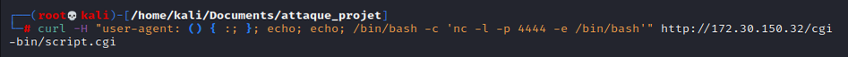
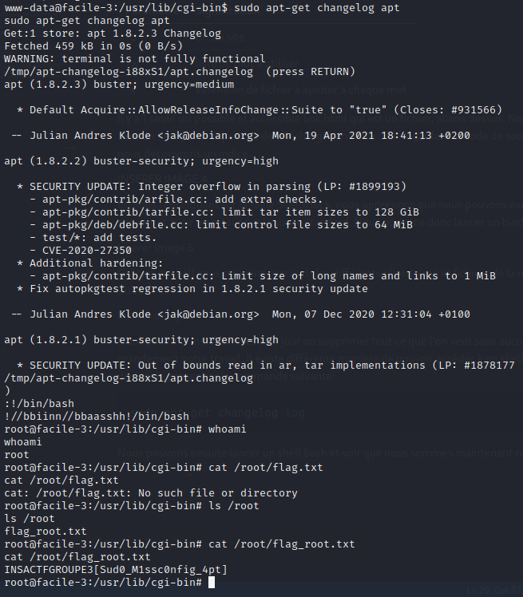

# Write-up CTF Facile 2 

## Etape 1 :  Analyse du Réseau

Premièrement, on effectue une analyse du réseau de la machine afin de voir quels ports sont ouverts : 

```bash
nmap 172.30.150.32
```

Résultat :


On constaste qu'il y a le port SSH d'ouvert et un service web, allons voir de ce coté ! 

## Etape 2 :  Recherche en profondeur

On retrouve la page par défaut d'Apache. Nous allons voir s'il n'y a pas des fichiers ou des redirections cachées avec l'outil ` gobuster `

```bash
gobuster dir -u http://172.30.150.32/ -w /usr/share/wordliste/dirbuster/directory-list-2.3-medium.txt -x .php,.html -t 40
```

| Paramètre | Signification |
|------------|---------------|
| -u          |   url du site          |
| -w          |   liste de mots à utiliser             |
| -x          |  extensions de fichier à ajouter à chaque mot             |


Il y a un seul fichier accessible, ***link.html***, allons dessus.
Nous arrivons sur une page basique avec un lien qui nous permet de télécharger un fichier. En regardant le code de source de la page, et en allant sur ce lien, nous découvrons un indice. 


## Etape 3 :  La faille Shellshock

En nous renseignant sur la faille Shellshock, nous apprenons que nous pouvons exécuter du code arbitrairement sur le serveur et avoir un retour sur la sortie standard. Nous pouvons donc lancer un bind shell via Netcat sur le port 4444. 



## Etape 4 :  Elévation des privilèges

Grâce à ce shell, nous pouvons parcourir les différents répertoires et fichiers de la machine. Nous lançons la commande `sudo -l`.


Nous pouvons installer, mettre à jour ou supprimer tout ce que l'on veut avec la commande `apt-get`, sans avoir à fournir de mot de passe. Voilà qui facilite grandement notre travail. Il existe plusieurs solutions pour accéder à un shell root. Dans notre cas nous avons décidé de passer par la commande suivante:

```bash
sudo apt-get changelog apt
```
Nous pouvons ensuite lancer un shell bash et voir que nous sommes maintenant root. 


