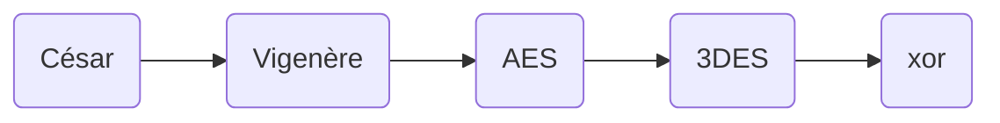

# Ctf Difficile : Documentation Technique et d'instalation

## Installation :


## Outils techniques : 

* ### Algorithme chiffrement : 


Dans cette partie nous allons nous attarder sur les différentes parties de l'algorithme de chiffrement et son fonctionnement

Pour rappel voici les différents algorithme utilisé et dans quel ordre : 

<center>



</center>

Tout ces algorithmes sont des algorithmes de chiffrement symétriques, la force de ces algorithmes provient de la complexité de la clée utilisé. Ici les clées seront cachés dans un fichier sécurisé par un vérou.


&emsp;&emsp; &emsp;  1. Lecture écriture de fichier en python

Afin de lire/écrite des fichier en python il faut manipuler une fonction native de python se nomant `open()` qui peut s'utiliser de la manière suivante (le détail de la fonction sera expliqué après)

```py
with open(full_path,"rb",) as input_file:
    #statement
```

La fonction `open()` permet d'avoir un objet fichier ce qui donne accès à des fonctions qui vont permettre de lire et d'écrire dans le fichier. Le statement `with    as` permet de gerer automatiquemement les exceptions, il est très utiliser dans la gestion de flux de données notament lorsque qu'on manipule des fichier. Cela permet notament d'éviter certaines fuites mémoire en fermant automatiquement les fichier que l'on a "ouvert". Cela permet donc d'avoir un code beaucoup plus propre. 

| Caractères | Signification |
|------------|---------------|
| a          |        ouvre en lecture (par défaut)       |
| w          |     ouvre en écriture, en effaçant le contenu du fichier          |
| x          |        	ouvre pour une création exclusive, échouant si le fichier existe déjà       |
| a          |         Ouvre en écriture, ajoute à la fin si le fichier existe      |
| b          |        mode binaire       |
| t          |       mode texte        |
| +          |   ouvre en modification (lecture et écriture)            |

Ici nous devons  lire et écrire les fichier de 2 manières différentes, pour césar et vigenère on lit et écris en mode texte, car nous faisons des modifications sur les caractères directement

```py
with open(
        full_path,
        "r",
    ) as encry, open("test1.txt", "w+") as o_file:

```

Pour le reste des algorithme on lit et écrit en binaire (même si dans les fais on écris aves des bytes), car les modifications ce réalise sur les bit où les octets directement 

```py
with open(
        full_path,
        "rb",
    ) as encry, open("test1.txt", "wb") as o_file:
        o_file.write(xor(encry.read(), key5))

```

Et pour écrire, dans les fichier on utilise la fonction `write` en passant dans la fonction les bytes où les caractères directement. 

&emsp;&emsp; &emsp;  2. César et vigenère 

Algorithme pour réaliser le décalage necessaire dans ces 2 algorithmes : 

```py
def cesar_crypt(key, letter):
    """Réalise le décalage de césar/vigenère 

    Args:
        key (String):  Clé de chiffrement 
        letter (String): Un caractère quelconque 

    Returns:
        String: Nouveau caractère après le shift
    """
    if 65 <= ord(letter) <= 90:  # Gestion des majuscules 
        return chr(65 + (ord(letter) - 65 + ord(key)) % 26) # ord renvoit la valeur ascii d'un caractère
    elif 97 <= ord(letter) <= 122: # Gestion minuscules 
        return chr(97 + (ord(letter) - 97 + ord(key)) % 26) # Chr renvoit le caractères associé à une valeur ascii
    elif 48 <= ord(letter) <= 57: # Gestion Chiffres 
        return chr(48 + (ord(letter) - 48 + ord(key)) % 10)
    else:  # Pour le reste on revoit le caractères 
        return str(letter)

```

Algorithme césar : 

```py
def cesar(in_file, key, o_file):
    """Réalise le chiffrement de césar, mais change de clé, pour chaque ligne du fichier afin de limiter
    les possibilites de brute force

    Args:
        in_file (File object): Fichier qu'on est en train de lire 
        key String: Clé de chiffrement
        o_file (file object): Fichier dans lequel on va écrire
    """
    cpt = 0 # Initialisation compteur 
    ciphertext = "" # On créer un texte chiffré qui n'a aucun caractère au début
    cesar_letter = split_string(key) # On sépart la clée afin d'avoir chaque caractère séparer dans une liste
    for word in in_file: # On lit chaque ligne du fichier 

        for character in word: # On regarde chaque caractères pour chaque ligne 
            ciphertext += cesar_crypt(cesar_letter[cpt % len(cesar_letter)], character)
            # Pour chaque caractère on ajoute au texte brouillé, la nouvelle lettre après le décalage 

        cpt = cpt + 1 # Incrémentation du compteur a chaque nouvelle ligne pour changé la clée

    o_file.write(ciphertext) # On écrit dans le fichier le texte chiffré
```

Algorithme vigenère : 

```py
def vigenere(in_file, key, o_file):
    """Réaliste le chiffrement de vigenère

    Args:
        in_file (File object): Fichier qu'on est en train de lire 
        key String: Clé de chiffrement
        o_file (File object ): Fichier dans lequel on va écrire
    """
    cpt = 0 #Initalisation du compteur à 0 
    ciphertext = ""  #On créer un texte chiffré qui n'a aucun caractère au début
    cesar_letter = split_string(key)# On sépart la clée afin d'avoir chaque caractère séparer dans une liste
    for word in in_file: # On lit chaque ligne du fichier 
        for character in word: # On regarde chaque caractères pour chaque ligne 
            ciphertext += cesar_crypt(cesar_letter[cpt % len(cesar_letter)], character)
            # On réaliste le décalage selon la lettre de la clé et la lettre du fichier 
            cpt = cpt + 1 # On incrémente le compteur pour changer la lettre avec lequel on effectue  le décalage pour chaque caractères 

    o_file.write(ciphertext) # on écrit le fichier 
```

&emsp;&emsp; &emsp;  3. 3DES et AES

Pour le triple DES on utilise la bibliothèque python [PyCryptodome](https://pycryptodome.readthedocs.io/en/latest/src/introduction.html) , qui est un package contenant des implémentations en python d'algorithme de chiffrement connus. Retrouvable à 

Instalation :

```bash
pip3 install pycryptodomex
```

Utilisation dans python :

``` py 
from Cryptodome.Cipher import DES3, AES
```


Algorithme 3DES : 
``` py
def TRIPLE_DES(file, key, o_file):
    """triple DES Algorithme

    Args:
        file (File object: Fichier que l'on veut chiffré
        key (String): Clée avec lequel on va chiffré 
        o_file (File object): Fichier dans lequel on va écrire 
    """
    hash_key = md5(key.encode("ascii")).digest() # On récupère sous forme d'octet la clée
    # On obient alors une clée de longueur 16 ce qui est necessaire pour le triple DES 
    TDES_key = DES3.adjust_key_parity(hash_key) # On ajuste la parité de la clée necessaire pour que cela fonctionne
    encrypted = DES3.new(TDES_key, DES3.MODE_EAX, nonce=b"0")
    # On créer un object DES3, avec comme paramètre la clée de longueur 16 dont on a ajuster la parité
    # On précise le mode necessaire ici le choix de du mode de chiffrage ici le choix de EAX (encrypt-then-authenticate-then-translate) a été fait
    # On set le nonce (Chiffre choisit arbitrairement ) utilisé dans le chiffrage pour empécher des attaques par rejeu
    # Dans le cas où certaines communications seraient interceptées 
    myfile = file.read() # On lit le fichier en entrée 
    bytes = encrypted.encrypt(myfile) # On créer une grande chaines d'octet correspondant au chiffrement de l'objet 3DES
    # Qui a eu en entrée le fichier que l'on veut chiffré

    o_file.write(bytes) # On écrit dans le fichier de sortie 
```


Algorithme AES : <br/>
Ici Contrairement à 3DES on veut utiliser le mode CBC, qui va apporter une confusion totale au chiffrement, chaque bloc sera chiffré selon le précedant, mais cela dans l'implémentation de l'algorithme en python necessite quelques ajouts en plus. 


``` py 
ddef ency_AES(i_file, key, o_file, path_name, size=64 * 1024):
    """ Implémentation du chiffrement AES avec la bibliothèque cryptodome

    Args:
        i_file (File object): fichier que l'on va lire et chiffré
        key (String ): Clée de chiffrement 
        o_file (file object): Fichier dans lequel on a écrire 
        path_name (String):  Path absolue du fichier que l'on va 
        size (int), optional): Taille des bloc qu'on va lire doit être un multiple de 16 . Defaults to 64*1024.
    """
    iv = os.urandom(16) # Création du vecteur d'intialisation d'une taille de 16 octets
    # Cela est necessaire pour pour mettre le chiffremment en mode CBC du premier bloc
    hash_key = sha256(key.encode("ascii")).digest() #On transforme la clée en une chaine d'octet de taille 16 
    encryptor = AES.new(hash_key, AES.MODE_CBC, iv) #  Création de l'objet AES
    # En entrée La clée "hashé", le mode de chiffrement ici CBC (avantage : confusion totale ), et notre vecteur d'initialisation

    filesize = os.path.getsize(path_name) #On récupère la taille du fichier que l'on va lire 

    o_file.write(struct.pack("<Q", filesize)) # On écrit dans le fichier de sortie la taille du fichier originale
    # En utilisant le package struct permettant la manupilation de bit mais sous forme d'octet 
    o_file.write(iv) # On écrit au début du fichier le vecteur d'initilisation (necessaire pour le déchiffrement par la suite )
    while True: # On lit tout le fichier 
        bloc = i_file.read(size) # On lit le bloc de la taille qu'on a passé en entrée 
        if len(bloc) == 0: #Si On a finnit de lire on quitte la boucle
            break
        elif len(bloc) % 16 != 0: # Sinon on continue
            bloc += b" " * (16 - len(bloc) % 16) # On fait du padding avec des espaces  pour remplir la fin du fichier pour que cela devienne un multiple de 16 

        o_file.write(encryptor.encrypt(bloc)) # On écrit dans le fichier 


```

&emsp;&emsp; &emsp;  4. XOR

Pour réaliser un xor, on fait sur chaque bit du fichier que l'on veut chiffrée un XOR (où exlusif) avec un bit d'une clée passée en entrée.

```py
def xor(file, key):
    """Réalise un xor entre un fichier entrée et une clé

    Args:
        file (File object): Fichier lu sous forme de caractères 
        key (String): Clée de chiffrement

    Returns:
        bytes: Chaine d'octet obtenue après le xor 
    """

    return bytes(a ^ b for a, b in zip(file, cycle(key)))
```


&emsp;&emsp; &emsp;  5. Algorithme en entier


```py

import os
import sys
import struct
from os import close, putenv, urandom
from typing import List
from itertools import cycle, islice
from des import des
from Cryptodome.Cipher import DES3, AES
from hashlib import md5, sha256
import functools
import operator
import random


def split_string(word):
    return [char for char in word]


def xor(file, key):
    """Réalise un xor entre un fichier entrée et une clé

    Args:
        file (File object): Fichier lu sous forme de caractères 
        key (String): Clée de chiffrement

    Returns:
        bytes: Chaine d'octet obtenue après le xor 
    """

    return bytes(a ^ b for a, b in zip(file, cycle(key)))


def cesar_crypt(key, letter):
    """Réalise le décalage de césar/vigenère 

    Args:
        key (String):  Clé de chiffrement 
        letter (String): Un caractère quelconque 

    Returns:
        String: Nouveau caractère après le shift
    """
    if 65 <= ord(letter) <= 90:  # Gestion des majuscules 
        return chr(65 + (ord(letter) - 65 + ord(key)) % 26) # ord renvoit la valeur ascii d'un caractère
    elif 97 <= ord(letter) <= 122: # Gestion minuscules 
        return chr(97 + (ord(letter) - 97 + ord(key)) % 26) # Chr renvoit le caractères associé à une valeur ascii
    elif 48 <= ord(letter) <= 57: # Gestion Chiffres 
        return chr(48 + (ord(letter) - 48 + ord(key)) % 10)
    else:  # Pour le reste on revoit le caractères 
        return str(letter)


def cesar(in_file, key, o_file):
    """Réalise le chiffrement de césar, mais change de clé, pour chaque ligne du fichier afin de limiter
    les possibilites de brute force

    Args:
        in_file (File object): Fichier qu'on est en train de lire 
        key String: Clé de chiffrement
        o_file (File object ): Fichier dans lequel on va écrire
    """
    cpt = 0 # Initialisation compteur 
    ciphertext = "" # On créer un texte chiffré qui n'a aucun caractère au début
    cesar_letter = split_string(key) # On sépart la clée afin d'avoir chaque caractère séparer dans une liste
    for word in in_file: # On lit chaque ligne du fichier 

        for character in word: # On regarde chaque caractères pour chaque ligne 
            ciphertext += cesar_crypt(cesar_letter[cpt % len(cesar_letter)], character)
            # Pour chaque caractère on ajoute au texte brouillé, la nouvelle lettre après le décalage 

        cpt = cpt + 1 # Incrémentation du compteur a chaque nouvelle ligne pour changé la clée

    o_file.write(ciphertext) # On écrit dans le fichier le texte chiffré


def vigenere(in_file, key, o_file):
    """Réaliste le chiffrement de vigenère

    Args:
        in_file (File object): Fichier qu'on est en train de lire 
        key String: Clé de chiffrement
        o_file (File object ): Fichier dans lequel on va écrire
    """
    cpt = 0 #Initalisation du compteur à 0 
    ciphertext = ""  #On créer un texte chiffré qui n'a aucun caractère au début
    cesar_letter = split_string(key)# On sépart la clée afin d'avoir chaque caractère séparer dans une liste
    for word in in_file: # On lit chaque ligne du fichier 
        for character in word: # On regarde chaque caractères pour chaque ligne 
            ciphertext += cesar_crypt(cesar_letter[cpt % len(cesar_letter)], character)
            # On réaliste le décalage selon la lettre de la clé et la lettre du fichier 
            cpt = cpt + 1 # On incrémente le compteur pour changer la lettre avec lequel on effectue  le décalage pour chaque caractères 

    o_file.write(ciphertext) # on écrit le fichier 


def DES(file, key, path):
    d = des()
    bytes = d.encrypt(key, file)
    path.write(bytes)


def TRIPLE_DES(file, key, o_file):
    """triple DES Algorithme

    Args:
        file (File object: Fichier que l'on veut chiffré
        key (String): Clée avec lequel on va chiffré 
        o_file (File object): Fichier dans lequel on va écrire 
    """
    hash_key = md5(key.encode("ascii")).digest() # On récupère sous forme d'octet la clée
    # On obient alors une clée de longueur 16 ce qui est necessaire pour le triple DES 
    TDES_key = DES3.adjust_key_parity(hash_key) # On ajuste la parité de la clée necessaire pour que cela fonctionne
    encrypted = DES3.new(TDES_key, DES3.MODE_EAX, nonce=b"0")
    # On créer un object DES3, avec comme paramètre la clée de longueur 16 dont on a ajuster la parité
    # On précise le mode necessaire ici le choix de du mode de chiffrage ici le choix de EAX (encrypt-then-authenticate-then-translate) a été fait
    # On set le nonce (Chiffre choisit arbitrairement ) utilisé dans le chiffrage pour empécher des attaques par rejeu
    # Dans le cas où certaines communications seraient interceptées 
    myfile = file.read() # On lit le fichier en entrée 
    bytes = encrypted.encrypt(myfile) # On créer une grande chaines d'octet correspondant au chiffrement de l'objet 3DES
    # Qui a eu en entrée le fichier que l'on veut chiffré

    o_file.write(bytes) # On écrit dans le fichier de sortie 


def ency_AES(i_file, key, o_file, path_name, size=64 * 1024):
    """ Implémentation du chiffrement AES avec la bibliothèque cryptodome

    Args:
        i_file (File object): fichier que l'on va lire et chiffré
        key (String ): Clée de chiffrement 
        o_file (file object): Fichier dans lequel on a écrire 
        path_name (String):  Path absolue du fichier que l'on va 
        size (int), optional): Taille des bloc qu'on va lire doit être un multiple de 16 . Defaults to 64*1024.
    """
    iv = os.urandom(16) # Création du vecteur d'intialisation d'une taille de 16 octets
    # Cela est necessaire pour pour mettre le chiffremment en mode CBC du premier bloc
    hash_key = sha256(key.encode("ascii")).digest() #On transforme la clée en une chaine d'octet de taille 16 
    encryptor = AES.new(hash_key, AES.MODE_CBC, iv) #  Création de l'objet AES
    # En entrée La clée "hashé", le mode de chiffrement ici CBC (avantage : confusion totale ), et notre vecteur d'initialisation

    filesize = os.path.getsize(path_name) #On récupère la taille du fichier que l'on va lire 

    o_file.write(struct.pack("<Q", filesize)) # On écrit dans le fichier de sortie la taille du fichier originale
    # En utilisant le package struct permettant la manupilation de bit mais sous forme d'octet 
    o_file.write(iv) # On écrit au début du fichier le vecteur d'initilisation (necessaire pour le déchiffrement par la suite )
    while True: # On lit tout le fichier 
        bloc = i_file.read(size) # On lit le bloc de la taille qu'on a passé en entrée 
        if len(bloc) == 0: #Si On a finnit de lire on quitte la boucle
            break
        elif len(bloc) % 16 != 0: # Sinon on continue
            bloc += b" " * (16 - len(bloc) % 16) # On fait du padding avec des espaces  pour remplir la fin du fichier pour que cela devienne un multiple de 16 

        o_file.write(encryptor.encrypt(bloc)) # On écrit dans le fichier 


def main(argv):

    key1 , key2,key3,key4,key5  = sys.argv[2],sys.argv[3],sys.argv[4],sys.argv[5],bytes(sys.argv[6],"utf8")
    #On lit ce que l'utilisation a mis comme clée lors de l'éxécution du script

    # On récupère le path du fichié que l'on veut récupérer 
    relative_path = sys.argv[1]

    # On transforme ce chemin relatif en chemin absolue
    full_path = os.path.abspath(relative_path)

    
    with open(
        full_path,
        "r",
    ) as encry, open("test1.txt", "w+") as o_file:
        cesar(encry, key1, o_file)
    os.remove(relative_path)
    os.rename("test1.txt", relative_path)

    with open(
        full_path,
        "r",
    ) as encry, open("test1.txt", "w+") as o_file:
        vigenere(encry, key2, o_file)
    os.remove(relative_path)
    os.rename("test1.txt", relative_path)
    
    with open(
        full_path,
        "rb",
    ) as encry, open("test1.txt", "wb") as o_file:
        ency_AES(
            encry,
            key3,
            o_file,
            full_path,
        )
    os.remove(relative_path)
    os.rename("test1.txt", relative_path)
    
    
    with open(
        full_path,
        "rb",
    ) as encry, open("test1.txt", "wb") as o_file:
        TRIPLE_DES(
            encry,
            key4,
            o_file,
        )
    os.remove(relative_path)
    os.rename("test1.txt", relative_path)
    
    
    
    with open(
        full_path,
        "rb",
    ) as encry, open("test1.txt", "wb") as o_file:
        o_file.write(xor(encry.read(), key5))
        
    os.remove(relative_path)
    os.rename("test1.txt", relative_path)


if __name__ == "__main__":
    main(sys.argv)


```

&emsp;&emsp; &emsp;  6. Obfuscation de code

Les attaquants, auront accès au bout d'un certain moment au code source de l'algorithme de chiffrement, cela serait très facile de faire les modifications , en effet nous utilisons des algorithmes de chiffrement symetriques. Ainsi nous allons obfuscer le code, c'est à dire le rendre humainement difficilement lisible mais restant exécutable.

Nous utilisons une bibliothèque python se sommant pyobfuscate afin de réaliser cela.

**Instalation et utilisation** : 

```sh
git clone https://github.com/astrand/pyobfuscate.git   
cd pyobfuscate    
sudo python3 setup.py install 
python3 pyobfuscate.py -r -v  "$PATH/encryp_algo.py"
```

Ce programme va alors print dans la console, le code obfusqué il suffit alors de copier coller le coder. Voici le résultat : 

```py
import os
import sys
import struct
from os import close , putenv , urandom
from typing import List
from itertools import cycle , islice
from des import des
from Cryptodome . Cipher import DES3 , AES
from hashlib import md5 , sha256
import functools
import operator
import random
def ooo0oOoooOOO0 ( word ) :
 return [ char for char in word ]
def oOO0OoOoo000 ( file , key ) :
 return bytes ( a ^ b for a , b in zip ( file , cycle ( key ) ) )
def iii111 ( key , letter ) :
 if 65 <= ord ( letter ) <= 90 :
  return chr ( 65 + ( ord ( letter ) - 65 + ord ( key ) ) % 26 )
 elif 97 <= ord ( letter ) <= 122 :
  return chr ( 97 + ( ord ( letter ) - 97 + ord ( key ) ) % 26 )
 elif 48 <= ord ( letter ) <= 57 :
  return chr ( 48 + ( ord ( letter ) - 48 + ord ( key ) ) % 10 )
 else :
  return str ( letter )
def oOo0O00O0ooo ( in_file , key , o_file ) :
 i11iIii = 0
 OO = ""
 iiI1I11iiiiI = ooo0oOoooOOO0 ( key )
 for iII11iIi1iIiI in in_file :
  for oOoO00 in iII11iIi1iIiI :
   OO += iii111 ( iiI1I11iiiiI [ i11iIii % len ( iiI1I11iiiiI ) ] , oOoO00 )
  i11iIii = i11iIii + 1
 o_file . write ( OO )
def iiI1111II ( in_file , key , o_file ) :
 i11iIii = 0
 OO = ""
 iiI1I11iiiiI = ooo0oOoooOOO0 ( key )
 for iII11iIi1iIiI in in_file :
  for oOoO00 in iII11iIi1iIiI :
   OO += iii111 ( iiI1I11iiiiI [ i11iIii % len ( iiI1I11iiiiI ) ] , oOoO00 )
   i11iIii = i11iIii + 1
 o_file . write ( OO )
def OoOo00 ( file , key , path ) :
 I1i1i = des ( )
 bytes = I1i1i . encrypt ( key , file )
 path . write ( bytes )
def iI1i ( file , key , o_file ) :
 IIIi1111iiIi1 = md5 ( key . encode ( "ascii" ) ) . digest ( )
 iI11i1iI1I1Ii = DES3 . adjust_key_parity ( IIIi1111iiIi1 )
 oOoOO0O0 = DES3 . new ( iI11i1iI1I1Ii , DES3 . MODE_EAX , nonce = b"0" )
 ooOo00o = file . read ( )
 bytes = oOoOO0O0 . encrypt ( ooOo00o )
 o_file . write ( bytes )
def o00ooo0Oooo ( i_file , key , o_file , path_name , size = 64 * 1024 ) :
 oOOOO0OO00 = os . urandom ( 16 )
 IIIi1111iiIi1 = sha256 ( key . encode ( "ascii" ) ) . digest ( )
 iIOooO0O = AES . new ( IIIi1111iiIi1 , AES . MODE_CBC , oOOOO0OO00 )
 i1i1iI1i1Iii = os . path . getsize ( path_name )
 o_file . write ( struct . pack ( "<Q" , i1i1iI1i1Iii ) )
 o_file . write ( oOOOO0OO00 )
 while True :
  iII1Ii = i_file . read ( size )
  if len ( iII1Ii ) == 0 :
   break
  elif len ( iII1Ii ) % 16 != 0 :
   iII1Ii += b" " * ( 16 - len ( iII1Ii ) % 16 )
  o_file . write ( iIOooO0O . encrypt ( iII1Ii ) )
def ooO0ooOOO00O0 ( argv ) :
 i11Ii , I11 , I1Ii , II , Ooo0O00o = sys . argv [ 2 ] , sys . argv [ 3 ] , sys . argv [ 4 ] , sys . argv [ 5 ] , bytes ( sys . argv [ 6 ] , "utf8" )
 OO0OOOoOOooO = sys . argv [ 1 ]
 OOo0OOo000o00 = "test1.txt"
 O0 = os . path . abspath ( OO0OOOoOOooO )
 with open (
 O0 ,
 "r" ,
 ) as i11I1IiIiI1i , open ( OOo0OOo000o00 , "w+" ) as O00O0O0Oo0oO :
  oOo0O00O0ooo ( i11I1IiIiI1i , i11Ii , O00O0O0Oo0oO )
 os . remove ( OO0OOOoOOooO )
 os . rename ( OOo0OOo000o00 , OO0OOOoOOooO )
 with open (
 O0 ,
 "r" ,
 ) as i11I1IiIiI1i , open ( OOo0OOo000o00 , "w+" ) as O00O0O0Oo0oO :
  iiI1111II ( i11I1IiIiI1i , I11 , O00O0O0Oo0oO )
 os . remove ( OO0OOOoOOooO )
 os . rename ( OOo0OOo000o00 , OO0OOOoOOooO )
 with open (
 O0 ,
 "rb" ,
 ) as i11I1IiIiI1i , open ( OOo0OOo000o00 , "wb" ) as O00O0O0Oo0oO :
  o00ooo0Oooo (
 i11I1IiIiI1i ,
 I1Ii ,
 O00O0O0Oo0oO ,
 O0 ,
 )
 os . remove ( OO0OOOoOOooO )
 os . rename ( OOo0OOo000o00 , OO0OOOoOOooO )
 with open (
 O0 ,
 "rb" ,
 ) as i11I1IiIiI1i , open ( OOo0OOo000o00 , "wb" ) as O00O0O0Oo0oO :
  iI1i (
 i11I1IiIiI1i ,
 II ,
 O00O0O0Oo0oO ,
 )
 os . remove ( OO0OOOoOOooO )
 os . rename ( OOo0OOo000o00 , OO0OOOoOOooO )
 with open (
 O0 ,
 "rb" ,
 ) as i11I1IiIiI1i , open ( OOo0OOo000o00 , "wb" ) as O00O0O0Oo0oO :
  O00O0O0Oo0oO . write ( oOO0OoOoo000 ( i11I1IiIiI1i . read ( ) , Ooo0O00o ) )
 os . remove ( OO0OOOoOOooO )
 os . rename ( OOo0OOo000o00 , OO0OOOoOOooO )
if __name__ == "__main__" :
 ooO0ooOOO00O0 ( sys . argv )

```

