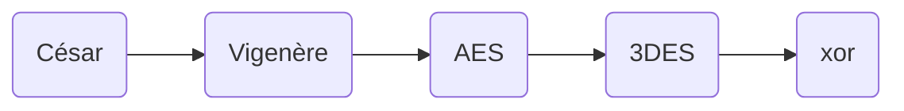

# Ctf Difficile : Documentation Technique et d'instalation

## Instalation :


## Outils technqiues : 

* ### Algorithme chiffrement : 


Dans cette partie nous allons nous attarder sur les différentes parties de l'algorithme de chiffrement et son fonctionnement

Pour rappel voici les différents algorithme utilisé et dans quel ordre : 

<center>



</center>


&emsp;&emsp; &emsp;  1. Lecture écriture de fichier en python

Afin de lire/écrite des fichier en python il faut manipuler une fonction native de python se nomant `open()` qui peut s'utiliser de la manière suivante (le détail de la fonction sera expliqué après)

```py
with open(full_path,"rb",) as input_file:
    #statement
```

La fonction `open()` permet d'avoir un objet fichier ce qui donne accès à des fonctions qui vont permettre de lire et d'écrire dans le fichier. Le statement `with    as` permet de gerer automatiquemement les exceptions, il est très utiliser dans la gestion de flux de données notament lorsque qu'on manipule des fichier. Cela permet notament d'éviter certaines fuites mémoire en fermant automatiquement les fichier que l'on a "ouvert". Cela permet donc d'avoir un code beaucoup plus propre. 

| Caractères | Signification |
|------------|---------------|
| a          |        ouvre en lecture (par défaut)       |
| w          |     ouvre en écriture, en effaçant le contenu du fichier          |
| x          |        	ouvre pour une création exclusive, échouant si le fichier existe déjà       |
| a          |         Ouvre en écriture, ajoute à la fin si le fichier existe      |
| b          |        mode binaire       |
| t          |       mode texte        |
| +          |   ouvre en modification (lecture et écriture)            |

Ici nous devons  lire et écrire les fichier de 2 manières différentes, pour césar et vigenère on lit et écris en mode texte, car nous faisons des modifications sur les caractères directement

```py
with open(
        full_path,
        "r",
    ) as encry, open("test1.txt", "w+") as o_file:

```

Pour le reste des algorithme on lit et écrit en binaire (même si dans les fais on écris aves des bytes), car les modifications ce réalise sur les bit où les octets directement 

```py
with open(
        full_path,
        "rb",
    ) as encry, open("test1.txt", "wb") as o_file:
        o_file.write(xor(encry.read(), key5))

```

Et pour écrire, dans les fichier on utilise la fonction `write` en passant dans la fonction les bytes où les caractères directement. 

&emsp;&emsp; &emsp;  2. César et vigenère 